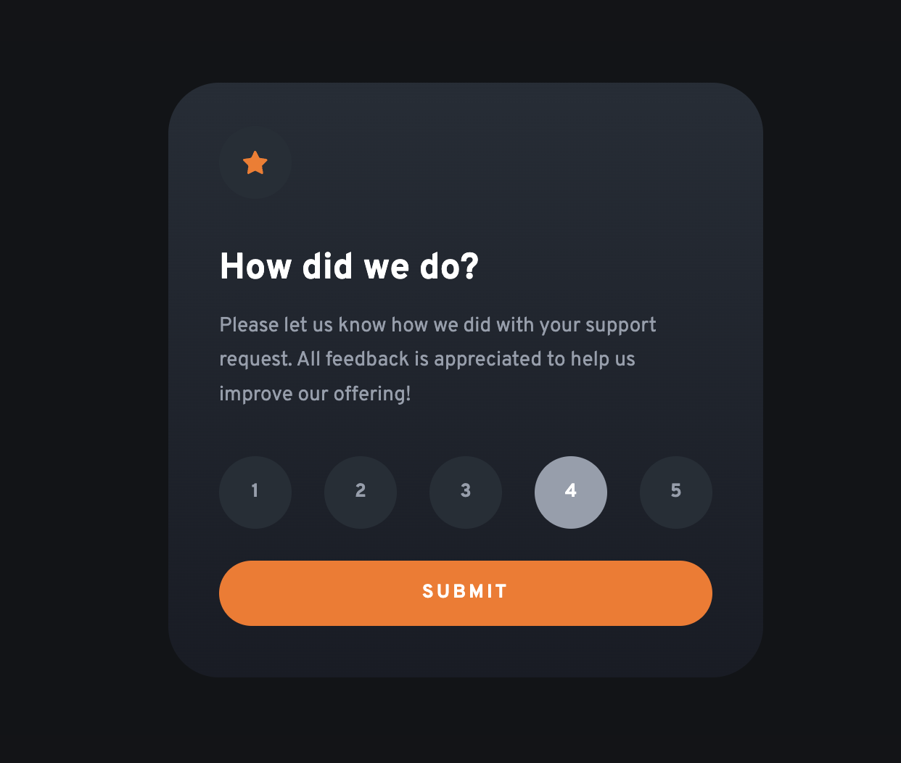
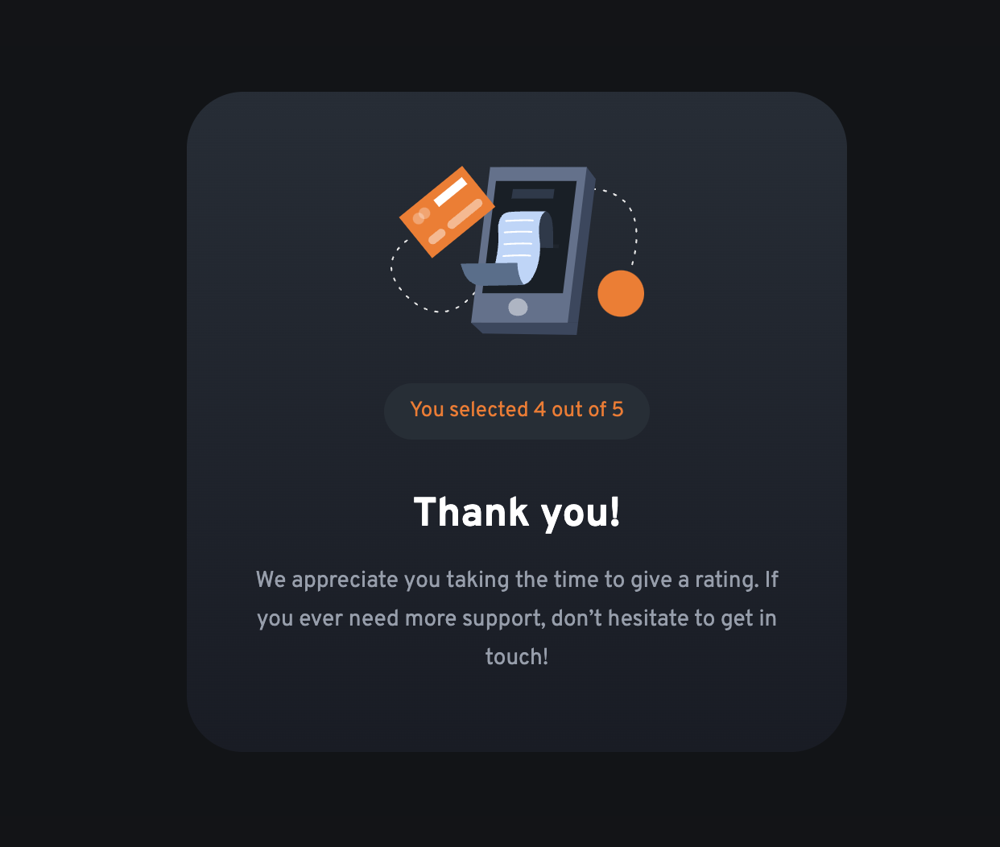

# Frontend Mentor - Interactive rating component solution

This is a solution to the [Interactive rating component challenge on Frontend Mentor](https://www.frontendmentor.io/challenges/interactive-rating-component-koxpeBUmI). Frontend Mentor challenges help you improve your coding skills by building realistic projects.

## Table of contents

- [Overview](#overview)
  - [The challenge](#the-challenge)
  - [Screenshot](#screenshot)
  - [Links](#links)
- [My process](#my-process)
  - [Built with](#built-with)
  - [What I learned](#what-i-learned)
- [Author](#author)

## Overview

### The challenge

Users should be able to:

- View the optimal layout for the app depending on their device's screen size
- See hover states for all interactive elements on the page
- Select and submit a number rating
- See the "Thank you" card state after submitting a rating

### Screenshot

### Links

- [See live site here](https://thomaserdmenger.github.io/interactiveRatingComponent/)
- [GitHub Repository](https://github.com/thomaserdmenger/interactiveRatingComponent)

## My process

### Built with

- Semantic HTML5 markup
- CSS custom properties
- Flexbox
- Mobile-first workflow
- JavaScript

### What I learned

I've learned how to add a focus state to various buttons so that the current state is removed when we click another button with JavaScript.

I have also learned how to get the value of an DOM element and have it appear as text in an other DOM element.

## Author

- Frontend Mentor - [@thomaserdmenger](https://www.frontendmentor.io/profile/thomaserdmenger)
- GitHub - [@thomaserdmenger](https://github.com/thomaserdmenger)
